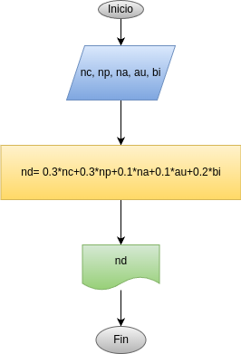

# Programa 2: nota_definitiva
Programa en Python para calcular la nota definitiva de una asignatura en el Colegio Guanentá.

## Análisis

### Variabes de entrada
- Nc: nota cognitiva
- Np: nota procedimental
- Na: nota actitudial
- Au: nota autoevaluacion
- Bi: nota bimestral

### Procesamiento
- Nd: Nota definitiva

nd= 0.3 * Nc + 0.3 * Np + 0.2 * Bi + 0.1 * Au + 0.1 * Na

## Diseño

## Construcción
- codigo implementado en el archivo nota_definitiva.py